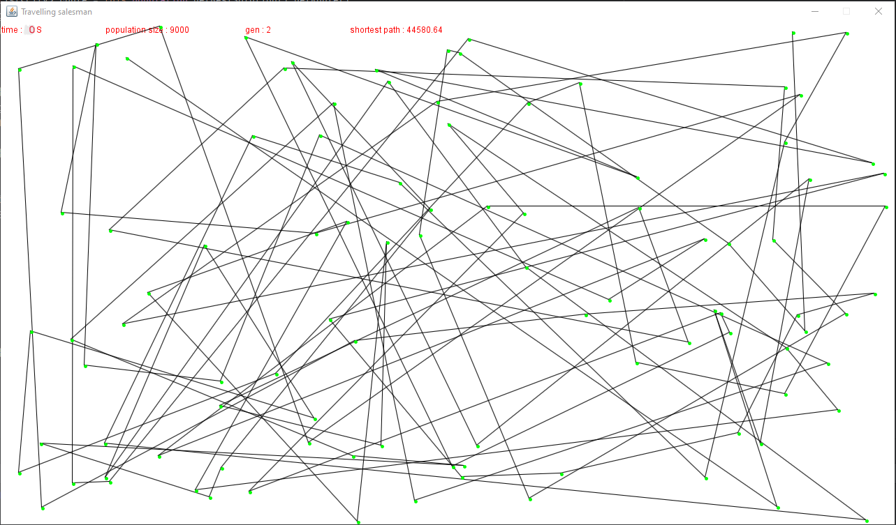
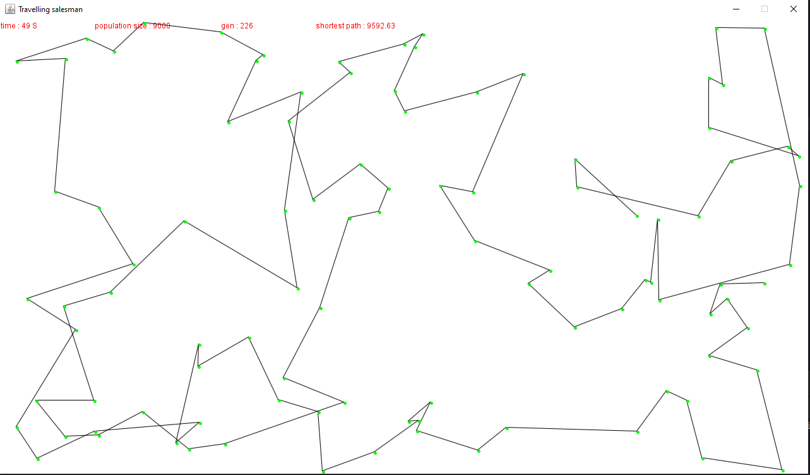
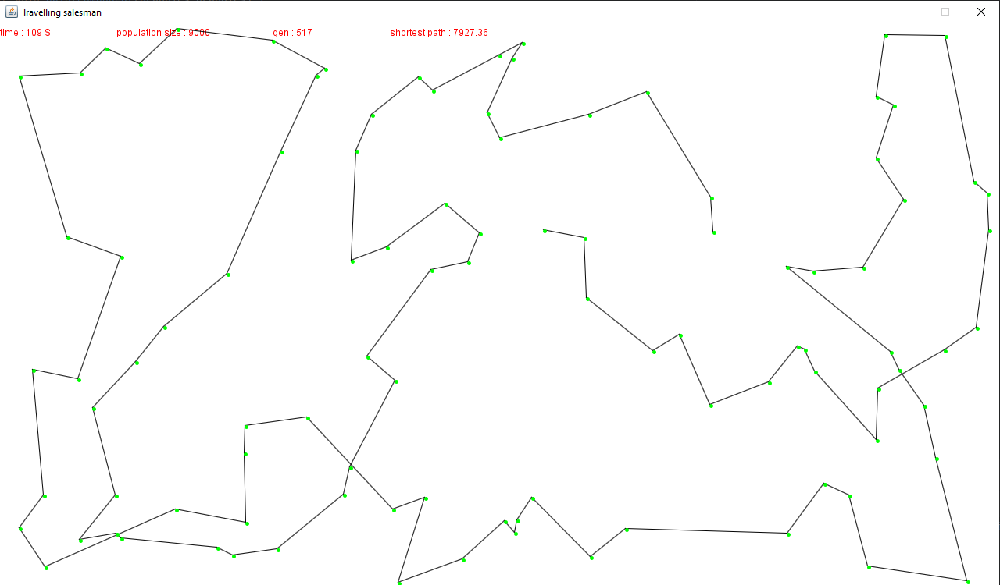

# Travelling-salesman
Travelling salesman problem with genetic algorithm

## Genetic Algorithm 
is adaptive heuristic search algorithms that belong to the larger part of evolutionary algorithms. based on the ideas of natural selection and genetics.
These are intelligent exploitation of random search provided with historical data to direct the search into the region of better performance in solution space. 

**algorithm steps:**\
    **1- Initialize a population of solutions. The solutions can be represented in a variety of ways, such as chromosomes, vectors, or trees.**\
    **2- Evaluate the fitness of each solution. The fitness of a solution is a measure of how good it is at solving the problem.
         for TSM problem  fitness condition is  shortest destination, chromosome = route between two cities and a gene in our case is a city.**\
    **3- Select parents for the next generation. The parents are selected based on their fitness. Typically, the fitter solutions are more likely to be selected.**\
    **4- Reproduce new solutions. New solutions are created by combining the genes of two parents. This is called crossover.**\
    **5- Mutate some of the new solutions. Mutation is a random change to a solution. It helps to prevent the algorithm from getting stuck in local optima.**\
    **6- Replace the old population with the new population.**\
    **7- Repeat steps 2-6 until a stopping criterion is met. The stopping criterion can be a maximum number of generations, a certain level of fitness, or a certain amount of time.**\
   
## result screenshot
#Initialize of a population

#after 49 sec 

#after 109 sec with ~500 generations

